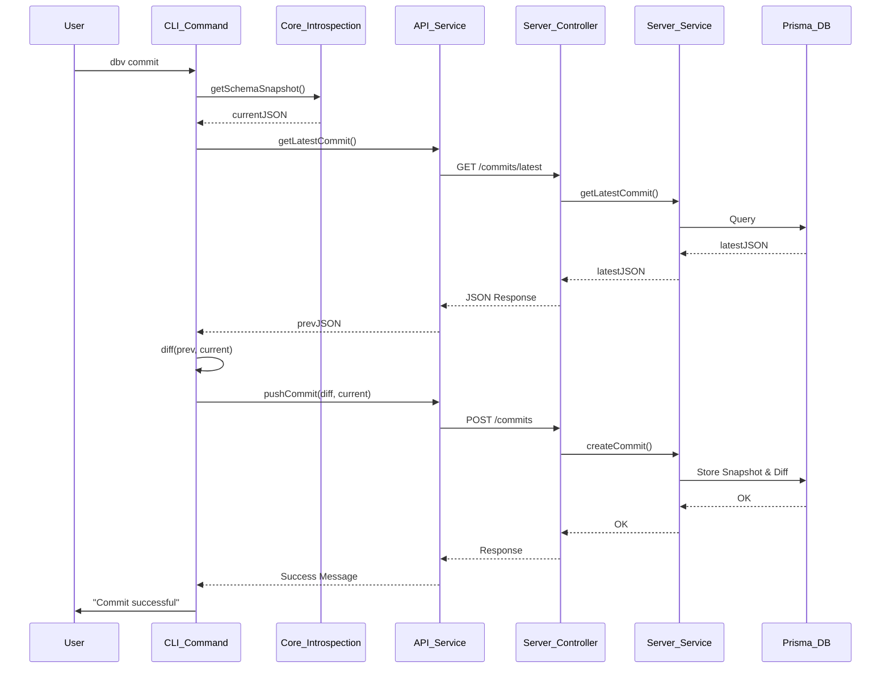

# DB-Git: Component Integration Map

This document explains how the components are connected and the call hierarchy, primarily for developers joining the project.

## 1. CLI Component Call Chain

When a user runs a command, e.g., `dbv commit -m "msg"`:

1.  **Entry Point (`cli/bin/dbv.js`)**:
    *   Uses `commander` to parse the command.
    *   Calls the corresponding handler in `cli/commands/commit.js`.

2.  **Command Handler (`cli/commands/commit.js`)**:
    *   Loads local configuration via `cli/utils/config.js`.
    *   Initializes `cli/services/api.js` with the remote URL.
    *   Calls **Member 2: Introspection** (`cli/core/introspection/index.js`) to read the local DB schema.
    *   Calls **`cli/services/api.js`** to fetch the latest remote schema snapshot.
    *   Calls **Member 3: Diff Engine** (`cli/core/diff/index.js`) to compare the two snapshots.
    *   If changes exist, calls **`cli/services/api.js`** to post the new commit to the server.

3.  **Core Engines**:
    *   `core/introspection`: Pure logic for Postgres schema reading.
    *   `core/diff`: Pure logic for JSON object comparison.

## 2. Backend (MVC + Services) Call Chain

When the Backend receives a request, e.g., `POST /projects/:name/commits`:

1.  **Express Route (`server/src/routes/projectRoutes.js`)**:
    *   Maps the URL pattern to a method in the Controller.

2.  **Controller (`server/src/controllers/projectController.js`)**:
    *   Extracts parameters (`req.params`, `req.body`).
    *   Handles response formatting (res.json, status codes).
    *   **Calls the Service Layer**.

3.  **Service (`server/src/services/projectService.js`)**:
    *   Contains the **Business Logic**.
    *   Checks if the project exists.
    *   Handles Branch and Head updates.
    *   Interacts with the database via **Prisma**.

4.  **Config/Database (`server/src/configs/db.js`)**:
    *   Exports the Prisma Client singleton used by all services.

## 3. Data Flow Diagram

## 4. Key Design Patterns
- **Singleton**: The `apiService` in CLI and `prisma` client in Server.
- **Service Layer**: Decouples business logic from Express/HTTP concerns.
- **Snapshots**: We store the FULL schema snapshot at every commit to allow instant reconstruction without replaying history (Member 5).
